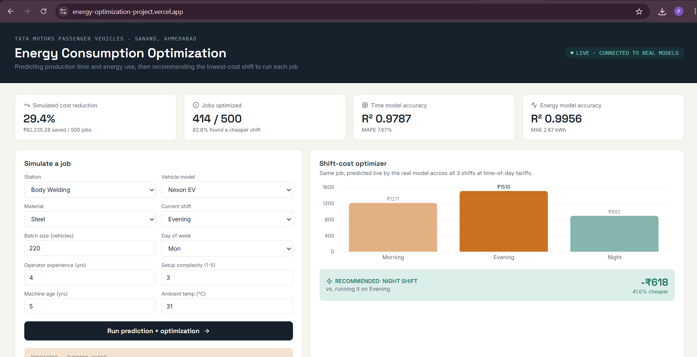
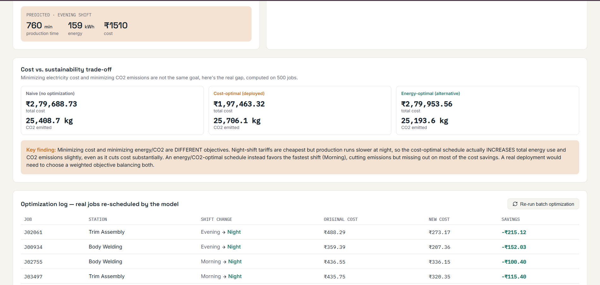
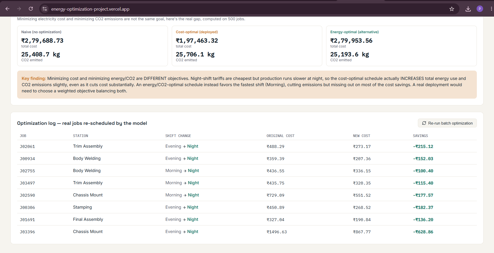

# ⚡ Energy Consumption Optimization Through Predicted Production Time

**An ML pipeline that predicts manufacturing job duration and energy use, then recommends the cheapest time to run it, built end-to-end with real trained models, a real backend, and a real deployed app.**

🔗 **[Live App](https://energy-optimization-project.vercel.app)** · 🔌 **[Live API Docs](https://energy-optimization-project.onrender.com/docs)** · 📦 **[This Repo](https://github.com/piyali-22/energy-optimization-project)**


---

## 📸 Screenshots

**Dashboard Overview & Live Optimizer**


**Predicted Result & Cost vs. Sustainability Trade-off**


**Optimization Log — Real Jobs Re-scheduled**


---

## Table of Contents

- [The Problem](#the-problem)
- [How It Works](#how-it-works)
- [Headline Results](#headline-results)
- [Features](#features)
- [Tech Stack](#tech-stack)
- [Project Structure](#project-structure)
- [Running It Yourself](#running-it-yourself)
- [Methodology](#methodology)
- [Limitations & Honest Caveats](#limitations--honest-caveats)
- [Future Improvements](#future-improvements)

---

## The Problem

Manufacturing plants schedule jobs without knowing in advance how long each job will take or how much electricity it will consume ,so there's no way to plan production around cheaper electricity hours. Electricity tariffs vary significantly by time of day (peak vs. off-peak), but without a way to *predict* a job's energy footprint before it runs, that pricing difference can't be exploited.

**This project closes that gap**: predict → estimate cost → recommend the cheapest feasible time slot — without changing what's actually produced.

---

## How It Works

```
Job details (station, vehicle, batch size, material, operator, shift...)
        │
        ▼
┌───────────────────────┐
│  Model 1: Time          │   RandomForestRegressor → predicted production time (min)
│  R² = 0.979             │
└───────────┬───────────┘
            │ (predicted time feeds into Model 2)
            ▼
┌───────────────────────┐
│  Model 2: Energy        │   RandomForestRegressor → predicted energy (kWh)
│  R² = 0.996             │
└───────────┬───────────┘
            │
            ▼
┌───────────────────────┐
│  Optimizer               │   Simulates Morning / Evening / Night tariffs,
│                          │   recommends the cheapest feasible shift
└───────────┬───────────┘
            │
            ▼
  FastAPI backend  ──────▶  React dashboard (live, deployed)
```

---

## Headline Results

| Metric | Value |
|---|---|
| Production time model accuracy | **R² = 0.979** (MAPE 7.7%) |
| Energy model accuracy | **R² = 0.996** (MAE 2.67 kWh) |
| Naive per-job optimization | **29.4% cost reduction** (₹82,225 saved / 500 jobs) |
| **Capacity-constrained optimization (realistic)** | **15% cost reduction — fully feasible**, respecting real station/shift capacity |
| Cost-optimal vs. emissions-optimal trade-off | Cost-optimal schedule cuts cost 29.4% but *increases* CO2 by ~1.2% — quantified explicitly, not hidden |

> **Why two different savings numbers?** The 29.4% figure comes from optimizing each job independently, which can recommend overloading a station beyond real capacity ,it's a theoretical ceiling, not an achievable schedule. The 15% figure comes from solving a proper constrained optimization problem (linear programming via PuLP) across an entire day's batch, respecting real capacity limits. **The 15% number is the one that's actually deployable.**

---

## Features

- 🔮 **Two chained ML models** — energy prediction uses the time model's own output as an input feature
- ⚙️ **Per-job shift optimizer** — simulates a job across all 3 shifts, recommends the cheapest
- 🏭 **Constrained multi-job optimizer** — solves a real Mixed-Integer Linear Program (PuLP/CBC) to schedule an entire batch of jobs within real station capacity limits
- 📊 **5-algorithm model comparison** — Linear Regression, Decision Tree, Random Forest, Gradient Boosting, XGBoost, benchmarked on identical data
- 🌱 **Cost vs. CO2 trade-off analysis** — quantifies where minimizing electricity cost and minimizing emissions actually conflict
- 🔍 **SHAP explainability** — every prediction can be broken down feature-by-feature, not a black box
- 🌐 **Real full-stack deployment** — FastAPI backend (Render) + React frontend (Vercel), not a notebook demo

---

## Tech Stack

| Layer | Tools |
|---|---|
| ML / Data | Python, pandas, scikit-learn, XGBoost, SHAP |
| Optimization | PuLP (CBC solver) |
| Backend | FastAPI, Pydantic, uvicorn |
| Frontend | React (Vite), Recharts, lucide-react |
| Deployment | Render (backend) · Vercel (frontend) |

---

## Project Structure

```
energy-optimization-project/
├── generate_dataset.py          # synthetic data generator (4,000 jobs)
├── train_model.py                # production time model + evaluation plots
├── train_energy_model.py         # energy consumption model
├── optimize_schedule.py          # per-job shift optimizer
├── multi_job_optimizer.py        # constrained MILP optimizer (PuLP)
├── model_comparison.py           # 5-algorithm benchmark
├── co2_tradeoff.py                # cost vs. emissions trade-off analysis
├── shap_explainability.py        # SHAP plots for model interpretability
│
├── data/                          # dataset + all computed results (CSV/JSON)
├── models/                        # trained .pkl models + metrics
├── plots/                         # all generated charts + screenshots
│
├── backend/                       # FastAPI app (deployed on Render)
│   └── main.py
└── frontend/                      # React app (deployed on Vercel)
    └── src/App.jsx
```

---

## Running It Yourself

### 1. Clone the repo
```bash
git clone https://github.com/piyali-22/energy-optimization-project.git
cd energy-optimization-project
```

### 2. Backend
```bash
cd backend
pip install -r requirements.txt
uvicorn main:app --reload --port 8000
```
Visit `http://localhost:8000/docs` for interactive API docs.

### 3. Frontend
```bash
cd frontend
npm install
npm run dev
```
Visit `http://localhost:3000`.

### 4. Re-run any analysis script
```bash
python multi_job_optimizer.py      # constrained optimization
python model_comparison.py          # 5-algorithm benchmark
python co2_tradeoff.py              # cost vs. CO2 analysis
python shap_explainability.py       # explainability plots
```

---

## Methodology

### Dataset
4,000 synthetic-but-realistic job records, generated using domain-reasonable formulas (not random noise) ,station type, vehicle model, batch size, material, operator experience, machine age, ambient temperature, shift, and day of week, with production time and energy consumption derived from physically sensible relationships (e.g. larger batches and harder materials take longer; experienced operators are faster; older machines run slower; night shifts run ~8% slower due to fatigue).

> Synthetic data was used because, as an intern, real plant production logs weren't accessible. The pipeline is fully reusable on real data — the same code, models, and optimizer would simply need retraining.

### Model Comparison

| Model | Time R² | Energy R² |
|---|---|---|
| **Gradient Boosting** | 0.987 | 0.996 |
| XGBoost | 0.985 | 0.996 |
| **Random Forest (deployed)** | 0.979 | 0.996 |
| Decision Tree | 0.960 | 0.990 |
| Linear Regression | 0.912 | 0.954 |

Random Forest is deployed; Gradient Boosting scored marginally higher and is documented here as a planned next step rather than hidden.

### Constrained Optimization
A simple per-job optimizer can recommend overloading a station beyond what an 8-hour shift can physically handle. `multi_job_optimizer.py` solves a proper Mixed-Integer Linear Program , minimizing total cost across an entire batch of jobs, subject to real per-station, per-shift capacity constraints — using PuLP's CBC solver.

### Cost vs. CO2 Trade-off
Night-shift electricity is the cheapest tariff, but production runs ~8% slower at night (fatigue factor) , meaning jobs consume *slightly more* energy when shifted to chase the cheap price. `co2_tradeoff.py` quantifies this explicitly: the cost-optimal schedule cuts cost 29.4% but increases CO2 emissions ~1.2%, while an energy-optimal alternative cuts emissions ~0.8% but barely saves any cost. **Minimizing cost and minimizing emissions are different objectives** — a real deployment would need a weighted balance of both.

### Explainability (SHAP)
`shap_explainability.py` generates global feature-importance plots and per-job waterfall breakdowns, showing exactly which features (and by how much) drove any individual prediction , batch quantity dominates, consistent with physical intuition.

---

## Limitations & Honest Caveats

- Dataset is synthetic, not real plant data (no access as an intern)
- Tariff rates and grid emission factor are representative illustrative values, not live utility figures
- The free-tier backend (Render) spins down after 15 minutes of inactivity , first request after idling takes ~50 seconds to wake up
- Capacity assumptions (machines per station, shift length) are illustrative, not the plant's actual configuration

---

## Future Improvements

- Retrain on real plant production logs if/when available
- Switch deployed model to Gradient Boosting (marginally higher accuracy, confirmed via benchmark)
- Add a weighted multi-objective optimizer balancing cost *and* CO2 explicitly
- Persistent database (PostgreSQL) instead of static CSVs for real job history logging

---

## Built By

**Piyali Khaitan** and **Vanshika Deswal**
Built as an internship project at Tata Motors Passenger Vehicles, Sanand, Ahmedabad.

[GitHub](https://github.com/piyali-22)
